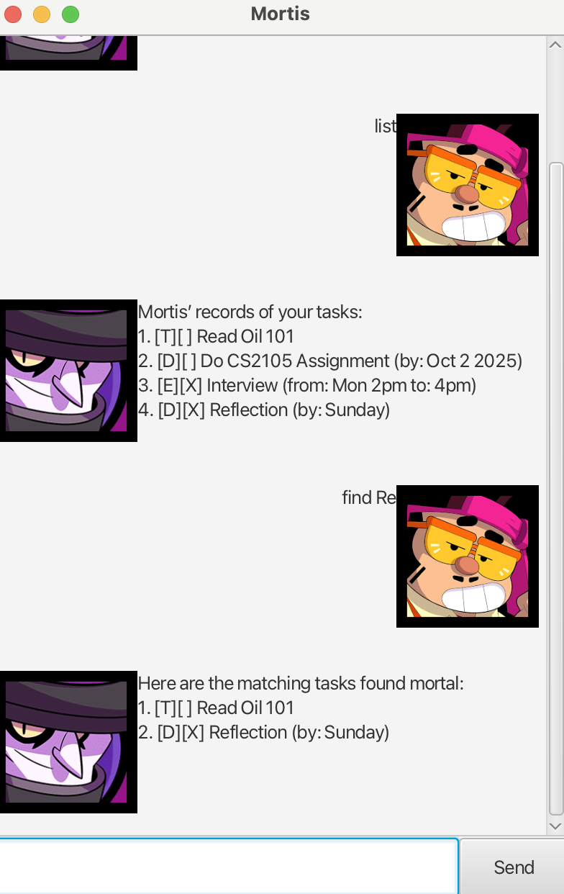

# Mortis User Guide



Mortis is a task management chatbot designed to help you 
track and organise your work. It supports simple todos, 
deadlines with dates, and events with time ranges. 
You can add, list, mark as done, delete, and edit tasks 
easily. Mortis stores your data so your tasks persist 
between runs.

## Adding deadlines

You can add a deadline task with a description and a due date.

Format: deadline <description> /by <date>

Example: `deadline submit assignment /by 2025-09-20`

```
Added this task:
  [D][ ] submit assignment (by: Sep 20 2025)
Now you have 1 task in the list.
```

## Adding Events

You can add an event with a description, a start time, and an end time.

Format: event <description> /from <start> /to <end>

Example: `event project meeting /from 2025-09-21 14:00 /to 2025-09-21 16:00
`

```
Added this task:
  [E][ ] project meeting (from: Sep 21 2025 14:00 to: Sep 21 2025 16:00)
Now you have 2 tasks in the list.
```

## Adding Todos

You can add a todo with just a description (no date/time needed).

Format: todo <description>

Example: `todo read book
`

```
Added this task:
  [T][ ] read book
Now you have 3 tasks in the list.
```

## Marking Tasks as Done

Mark a task as completed by specifying it's number in the list.

Format: mark <task number>

Example: `mark 3
`

```
Ah... the task is now done. The darkness has claimed it:
  [T][X] read book
```

## Unmarking Tasks

Unmark a task by specifying it's number in the list.

Format: unmark <task number>

Example: `unmark 3
`

```
OK... I've pulled the task back from the abyss. It is undone now:
  [T][] read book
```

## Deleting Tasks

Remove a task from the list by specifying its number.

Format: delete <task number>

Example: `delete 3
`

```
Removed this task:
  [T][] read book
Now you have 2 tasks in the list.
```

## Editing Tasks

Use edit to update details of an existing task (description, deadline, or event times).

Format: edit <task number> <new description or date/time>

Example: `edit 1 /desc submit CS2103 assignment /by 2025-10-22
`

```
Edited task:
  [D][] submit CS2103 assignment (by: Oct 22 2025)
```

## Finidng Tasks

Find a task through fuzzy matching of it's description.

Format: Find <description>

Example: `find b
`

```
Here are the matching tasks found mortal:
  1. [D][] submit CS2103 assignment (by: Oct 22 2025)
```

## Saving and Loading

Tasks are automatically saved to your hard disk (Storage.java) whenever you add, edit, or delete.

When you restart Mortis, your tasks are loaded back automatically so you don’t lose progress.


## Exiting the program

Format: bye

Example: `bye
`

```
Farewell. Mortis slumbers...
```
